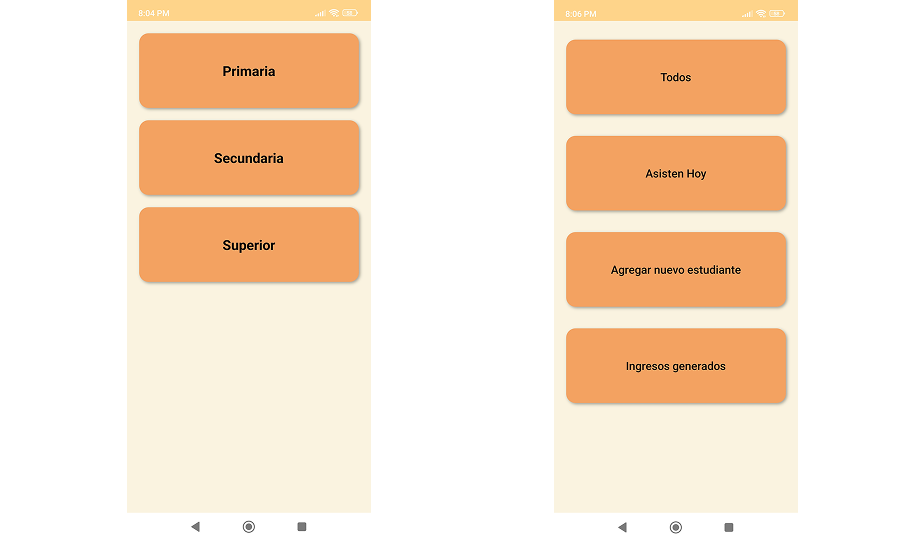

# 📚 Academia Aprendemos Juntos

**Academia Aprendemos Juntos** es una aplicación móvil educativa desarrollada para dispositivos Android. Su objetivo principal es facilitar el aprendizaje colaborativo entre estudiantes y profesores, a través de una experiencia interactiva, intuitiva y amigable.

Esta app ha sido desarrollada utilizando **React Native** con el entorno de desarrollo **Expo**, lo que permite una construcción rápida, escalable y compatible con múltiples plataformas móviles.

---

## 🚀 Características Principales

- Registro e inicio de sesión de usuarios
- Visualización de cursos disponibles
- Inscripción a cursos y seguimiento del progreso
- Recursos multimedia: videos, documentos y enlaces externos
- Foro de preguntas y respuestas
- Notificaciones push

---

## 🛠 Tecnologías Utilizadas

| Tecnología         | Descripción                                                                 |
|--------------------|-----------------------------------------------------------------------------|
| React Native        | Framework para el desarrollo de apps móviles multiplataforma                |
| Expo                | Herramienta para facilitar el desarrollo y despliegue de apps React Native |
| Firebase            | Autenticación, base de datos en tiempo real y almacenamiento               |
| React Navigation    | Manejo de navegación dentro de la aplicación                               |
| Redux / Context API | Manejo del estado de la aplicación                                          |
| NativeBase / UI Kitten | Librerías para componentes UI personalizados                          |
| Push Notifications  | Sistema de alertas y recordatorios para el usuario                         |

---

## 📸 Capturas de Pantalla

A continuación, algunas imágenes de muestra de la aplicación:

### Pantalla de Inicio


### Lista de Cursos


### Detalle del Curso


> Asegúrate de tener estas imágenes en la carpeta `assets/screenshots/` de tu repositorio.

---

## 📦 Instalación y Ejecución

1. Clona el repositorio:

   ```bash
   git clone https://github.com/tu_usuario/academia-aprendemos-juntos.git
   cd academia-aprendemos-juntos
