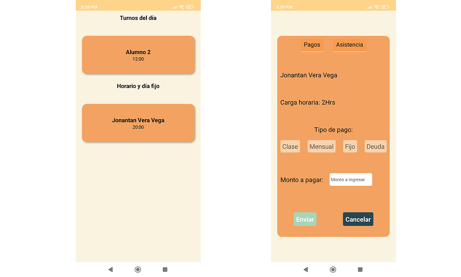
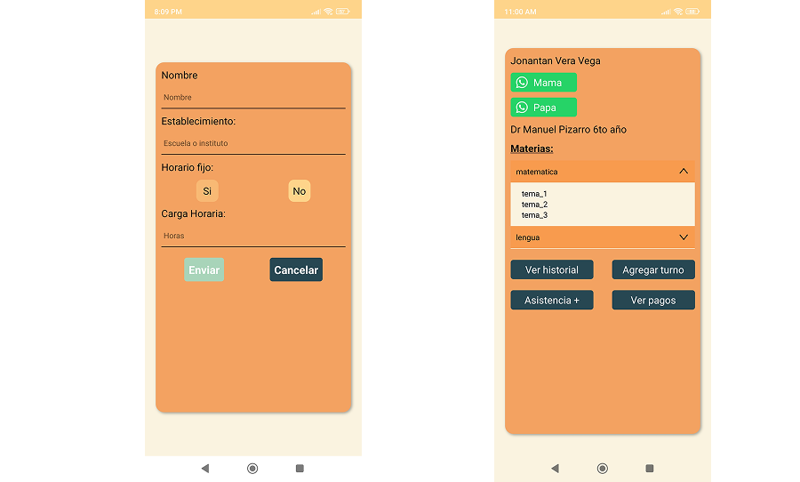

# 📚 Academia Aprendemos Juntos

**Academia Aprendemos Juntos** es una aplicación móvil educativa desarrollada para dispositivos Android. Su objetivo principal es facilitar la administracion de horarios y material de estudio de los estudiantes en la academia, a través de una experiencia interactiva, intuitiva y amigable.

Esta app ha sido desarrollada utilizando **React Native** con el entorno de desarrollo **Expo**, lo que permite una construcción rápida, escalable y compatible con múltiples plataformas móviles.

---

## 🚀 Características Principales

- Registro y asistencia de Alumnos
- Visualización de turnos en tiempo
- Inscripción de nuevos alumnos y seguimiento del progreso
- Recursos multimedia: videos, documentos y enlaces externos (en construccion)
- Telefonos de emergencias

---

## 🛠 Tecnologías Utilizadas

| Tecnología         | Descripción                                                                 |
|--------------------|-----------------------------------------------------------------------------|
| React Native        | Framework para el desarrollo de apps móviles multiplataforma                |
| Expo                | Herramienta para facilitar el desarrollo y despliegue de apps React Native |
| Firebase            | Base de datos en tiempo real y almacenamiento               |
| React Expo Navigation    | Manejo por carpetas dentro de la aplicación                               |
| Context API | Manejo del estado de la aplicación   |
                  

---

## 📸 Capturas de Pantalla

A continuación, algunas imágenes de muestra de la aplicación:

### Pantalla de Inicio


### Lista de Asistencia de Alumnos


### Agregar nuevo Alumno



---

## 📦 Instalación y Ejecución

1. Clona el repositorio:

   ```bash
   git clone https://github.com/jakiro12/academia_v1
   cd academia_v1
   npx expo start